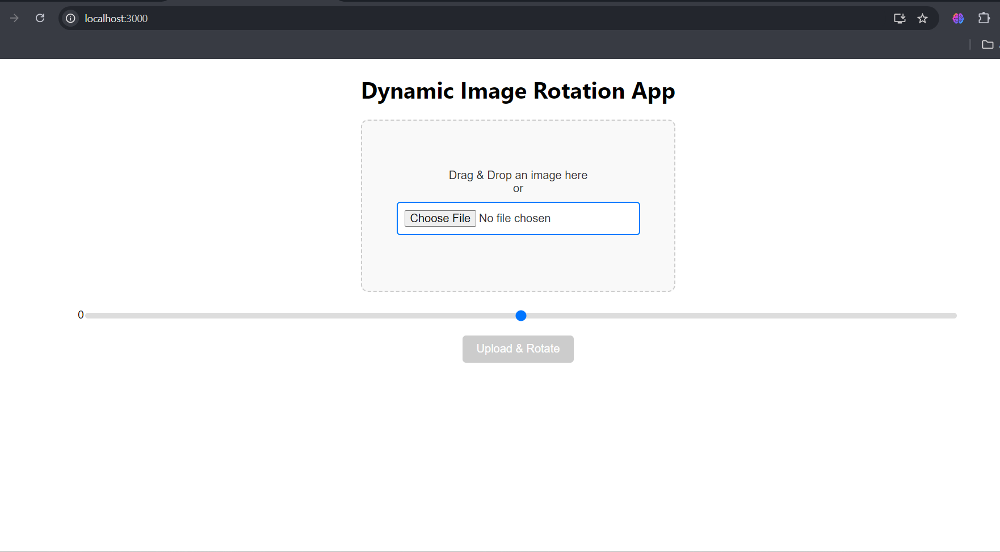

# Image Rotation Web Application

A **ReactJS** and **Node.js** web application that allows users to upload an image, rotate it dynamically by a specified degree (0-360°), and download the rotated image. The application supports both drag-and-drop and traditional file input options for image upload.

## Features
- **Image Upload**: Users can upload an image either via drag-and-drop or by selecting a file from their system.
- **Dynamic Rotation**: Users can use a slider to adjust the degree of rotation (0° to 360°) and preview the rotated image instantly.
- **Download Option**: After rotation, users can download the rotated image directly to their system.
- **Backend Processing**: The rotation is processed dynamically both on the frontend (for preview) and backend (for final processing and download).

## Technologies Used
- **Frontend**: ReactJS, Axios
- **Backend**: Node.js, Express, Sharp
  
## Screenshots
Include screenshots of your app to showcase the UI and functionality.
  
1. **Main Screen**: 
   
  
2. **Rotation Preview**: 
   

## Installation

### Prerequisites
- **Node.js**: Make sure you have Node.js installed on your system.
- **npm or yarn**: You'll need `npm` or `yarn` to install the necessary dependencies.

### 1. Clone the Repository
```bash
git clone https://github.com/your-username/image-rotation-app.git
cd image-rotation-app
```

### 2. Backend Setup

1. Navigate to the backend folder:
   ```bash
   cd backend
   ```
2. Install backend dependencies:
   ```bash
   npm install
   ```
3. Start the Node.js backend server:
   ```bash
   node server.js
   ```
   The backend will run on `http://localhost:5000`.

### 3. Frontend Setup

1. Navigate to the frontend folder:
   ```bash
   cd image-rotation-app
   ```
2. Install frontend dependencies:
   ```bash
   npm install
   ```
3. Start the React app:
   ```bash
   npm start
   ```
   The frontend will be available at `http://localhost:3000`.

## Usage
1. Launch the app in your browser at `http://localhost:3000`.
2. Upload an image using the drag-and-drop feature or by selecting a file.
3. Adjust the rotation using the slider to preview the image.
4. Click "Upload & Rotate" to send the image to the backend for processing.
5. After the image is processed, a processeddownload button will appear. Click to download the rotated image.

## Contribution
Contributions are welcome! If you have any ideas or suggestions, feel free to create a pull request or open an issue.


